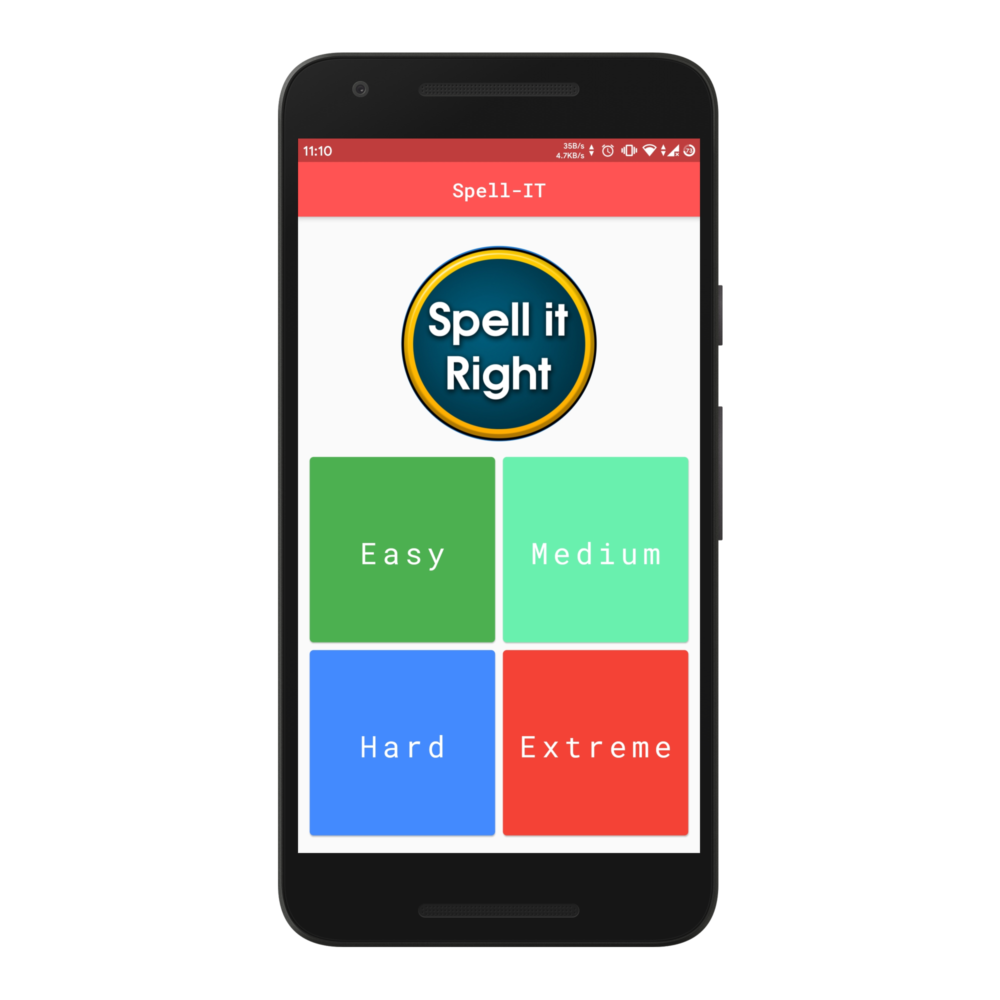
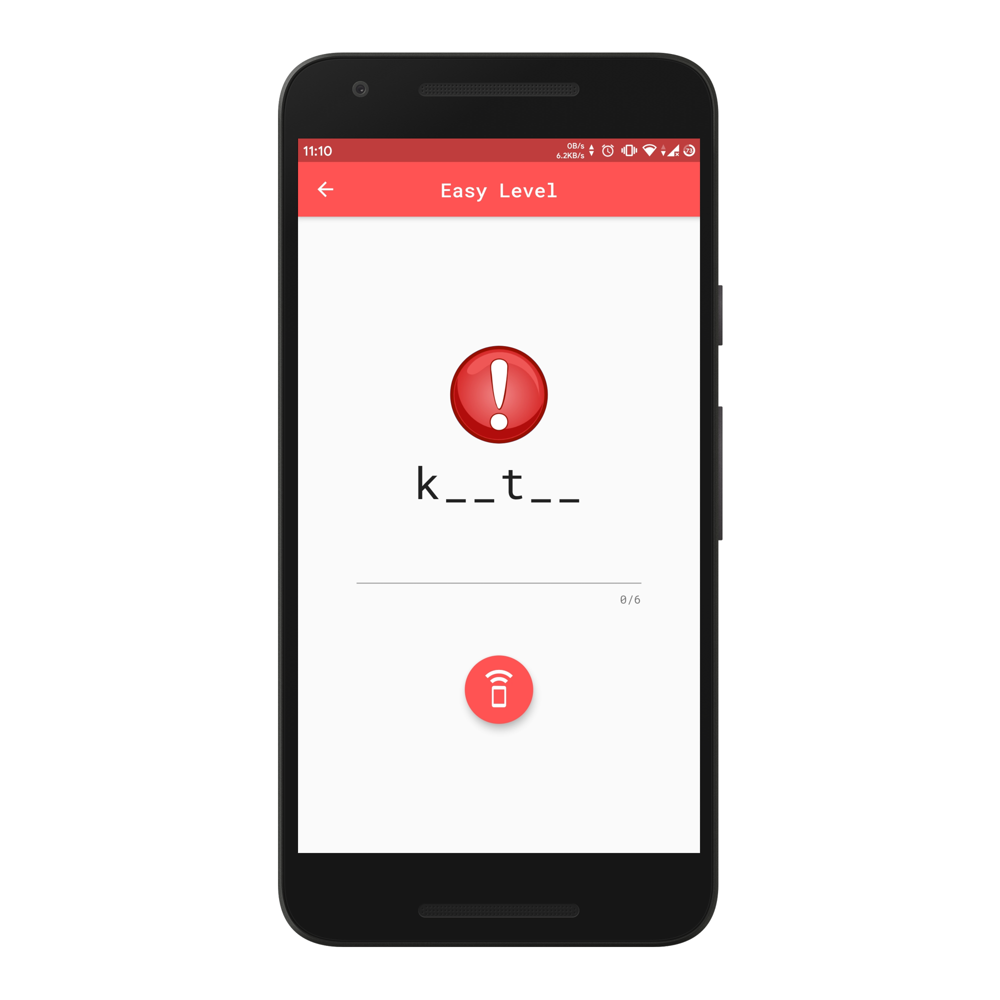
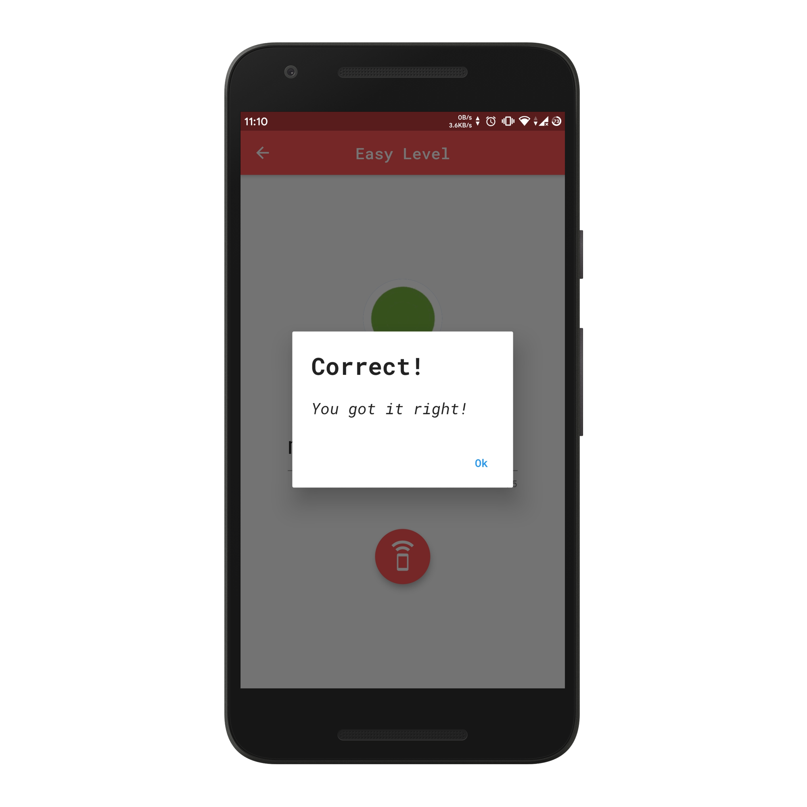
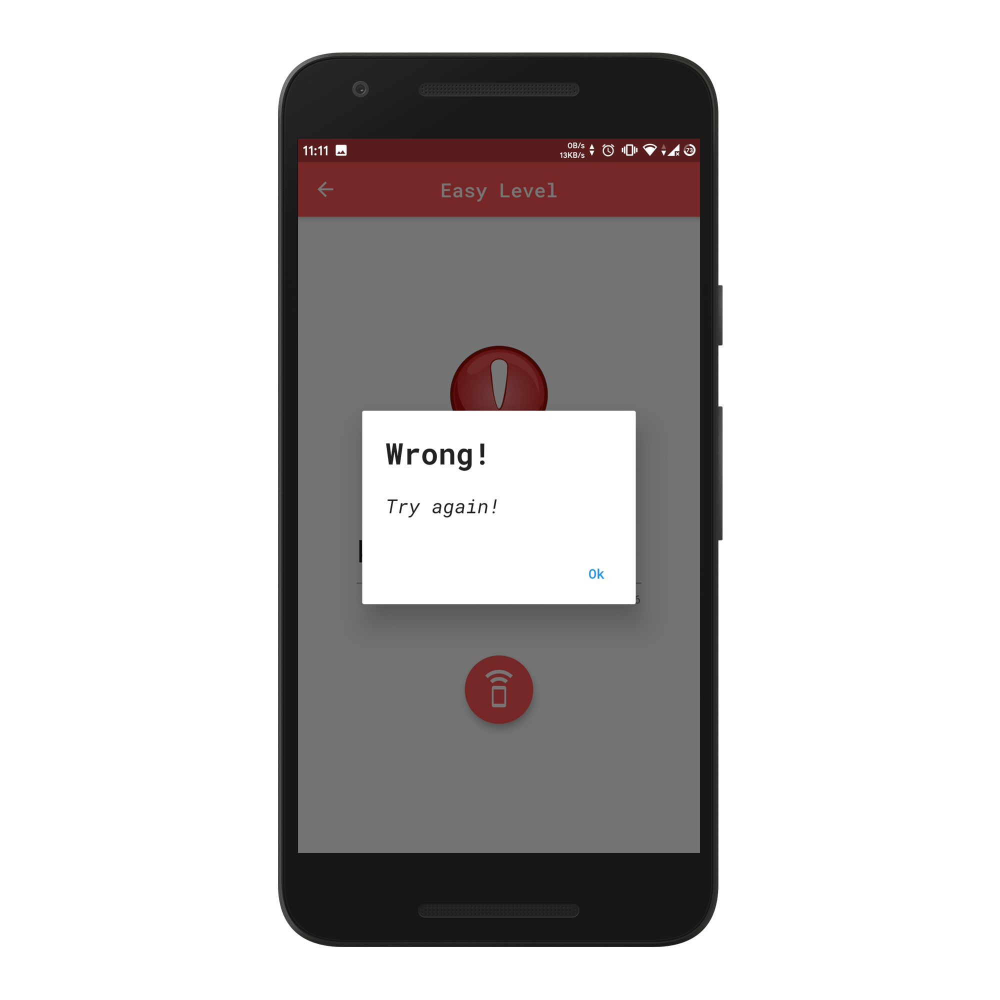

<p align="center">
  


<h1 align="center"> Spell IT </h1> <br>
<p align="center">
   A free, spelling game for improving your english vocabulary.
</p>
<p align="center">
    
    
    
    
    
    
    
    

</p>
<p align="center">
    <a href="https://github.com/AkashRajpurohit/Spell-IT/releases">
    <a/><br><br><br>
</p>
<p align="center">
    
    
    
    
    
</p>

## 🗺 Roadmap
* [x] Generate app with flutter
* [x] Generate basic screens (Home. GameScreen)
* [x] Flutter Text To Speech Functionality
* [x] Update logo and fonts of the app
* [x] Pageview to generate the gamescreen where multiple questions are showed
* [x] Generate word hints by randomizing `_` in letters of word
* [x] Show alerts when user has given right or wrong answers
* [x] Shared Preferences
  * [x] Store score of user based on the level
  * [x] Retrieve the score and show a `success` image for solved questions
* [x] Connect to nodejs API deployed on firebase
* [x] Show loader while the data is loading from the API
* [x] Lock the next level until the user has completed 60% of questions from previous level
* [x] Caching questions in shared preferences to reduce network calls and improve performance and user experience

## 🙌 Contribution 

* Fork this Project

* Git clone

* ``` cd Spell-IT && flutter run ``` 

* make changes to code

* Create a Pull request

## 💵 Support
> If you found this project helpful or you learned something from the source code and want to thank me, consider buying me a cup of :coffee:

[](https://www.paypal.me/RajpurohitAkash)


## 🐛 Bugs or Requests

If you encounter any problems feel free to open an [issue](https://github.com/AkashRajpurohit/Spell-IT/issues/new?template=bug_report.md). If you feel the library is missing a feature, please raise a [ticket](https://github.com/AkashRajpurohit/Spell-IT/issues/new?template=feature_request.md) on GitHub and I'll look into it. Pull request are also welcome.

## 🗒️ License

**Spell-IT** is licensed under `MIT license`.

## Visit My Portfolio
[Akash Rajpurohit](https://akashrajpurohit.cf)
