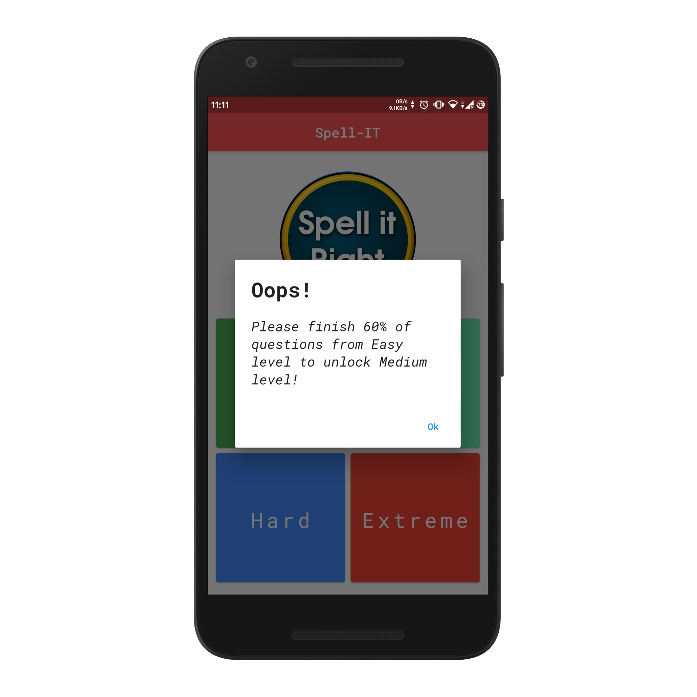

# Spell-IT

# Table of contents
  * [Goals](#goals)
  * [Screenshots](#screenshots)
  * [Donate](#donate)
  * [License](#license)
  * [About Author](#visit-my-portfolio)

# Goals
* [x] Generate app with flutter
* [x] Generate basic screens (Home. GameScreen)
* [x] Flutter Text To Speech Functionality
* [x] Update logo and fonts of the app
* [x] Pageview to generate the gamescreen where multiple questions are showed
* [x] Generate word hints by randomizing `_` in letters of word
* [x] Show alerts when user has given right or wrong answers
* [x] Shared Preferences
  * [x] Store score of user based on the level
  * [x] Retrieve the score and show a `success` image for solved questions
* [x] Connect to nodejs API deployed on firebase
* [x] Show loader while the data is loading from the API
* [x] Lock the next level until the user has completed 60% of questions from previous level
* [x] Caching questions in shared preferences to reduce network calls and improve performance and user experience

# Screenshots
Main Screen                |  Game Screen
:-------------------------:|:-------------------------:
  |  

   Correct Answer                             |   Wrong Answer                            
:--------------------------------------------:|:------------------------------------------:
  | 

Level Warning Screen                         |
:-------------------------------------------:|
|

# Donate
> If you found this project helpful or you learned something from the source code and want to thank me, consider buying me a cup of :coffee:

# Download
You can [download](https://github.com/AkashRajpurohit/Spell-IT/releases/download/v1.0.1/app-arm64-v8a-release.apk) the application for android and try it yourself.

# Bugs or Requests

If you encounter any problems feel free to open an [issue](https://github.com/AkashRajpurohit/Spell-IT/issues/new?template=bug_report.md). If you feel the library is missing a feature, please raise a [ticket](https://github.com/AkashRajpurohit/Spell-IT/issues/new?template=feature_request.md) on GitHub and I'll look into it. Pull request are also welcome.

# License

**Spell-IT** is licensed under `MIT license`.

## Visit My Portfolio
[Akash Rajpurohit](https://akashrajpurohit.cf)
